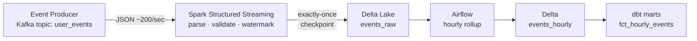

<div align="center">

# ⚡ Real-Time Events Pipeline

### Streaming data pipeline ingesting **10K+ clickstream events/min** via **Kafka → Spark Structured Streaming → Delta Lake** (exactly-once) with **dbt** marts — at **sub-minute event-to-insight latency**.

<br/>


</div>

---

## 📑 Table of Contents

- [🎯 Overview](#-overview)
- [⚙️ Scale & Performance](#️-scale--performance)
- [🏗️ Architecture](#️-architecture)
- [🧰 Tech Stack](#-tech-stack)
- [🔑 Streaming Concepts](#-streaming-concepts-demonstrated)
- [📂 Project Structure](#-project-structure)
- [🚀 Quick Start](#-quick-start)
- [💡 Key Engineering Decisions](#-key-engineering-decisions)

---

## 🎯 Overview

Most data engineers can build batch pipelines — fewer can build **reliable streaming** ones. This project demonstrates real-time ingestion with **exactly-once semantics**, **checkpointing**, **watermarking** for late data, and **stateful aggregation** — the genuinely hard parts of streaming.

Events flow from a **Kafka** producer into **Spark Structured Streaming**, land in **Delta Lake** exactly-once, and are rolled up hourly into **dbt** marts — all orchestrated and monitored with **Apache Airflow**. It complements my batch project ([retail-lakehouse-pipeline](https://github.com/adityayadav97/retail-lakehouse-pipeline)) to show the full data-engineering spectrum.

---

## ⚙️ Scale & Performance

| Aspect | Value |
| :--- | :--- |
| 🚀 Ingest throughput | **10K+ events/min** (default 200 events/sec ≈ 12K/min) |
| ⏱️ Latency | **Sub-minute** event-to-insight (30s micro-batch trigger) |
| 🎯 Delivery guarantee | **Exactly-once** (Delta sink + checkpointing) |
| 🕒 Late data | Tolerated up to 10 min via event-time watermarking |
| 📦 Backpressure | Bounded micro-batches (`maxOffsetsPerTrigger = 20,000`) |

---

## 🏗️ Architecture



---

## 🧰 Tech Stack

| Category | Tools |
| :--- | :--- |
| **Streaming** | Apache Kafka 3.6, Spark Structured Streaming 3.5 |
| **Storage** | Delta Lake (exactly-once sink, checkpointing) |
| **Late-data handling** | Event-time watermarking + deduplication |
| **Batch + Modeling** | PySpark hourly rollup, dbt marts |
| **Orchestration** | Apache Airflow 2.8 |
| **Local Infra** | Docker Compose (Kafka + Zookeeper) |

---

## 🔑 Streaming Concepts Demonstrated

| Concept | How it's used |
| :--- | :--- |
| **Exactly-once** | Delta sink + Spark checkpointing guarantees no duplicates / no loss |
| **Watermarking** | Late events tolerated up to 10 minutes via `withWatermark` |
| **Deduplication** | `dropDuplicates` on `event_id` within the watermark window |
| **Stateful aggregation** | Windowed event counts per event type |
| **Schema enforcement** | Explicit schema applied to Kafka JSON payloads |
| **Backpressure** | `maxOffsetsPerTrigger` bounds micro-batch size at 10K+/min |
| **Sub-minute latency** | 30-second micro-batch trigger for near-real-time marts |

---

## 📂 Project Structure

```
realtime-events-pipeline/
├── src/
│   ├── config.py
│   ├── producer/event_producer.py     # simulates 10K+ events/min into Kafka
│   ├── streaming/stream_consumer.py    # Spark Structured Streaming → Delta
│   └── batch/hourly_rollup.py          # hourly aggregation → Delta
├── dags/streaming_monitor_dag.py       # Airflow: rollup + dbt + freshness check
├── dbt/models/marts/fct_hourly_events.sql
├── tests/test_event_schema.py
├── docker-compose.yml                  # Kafka + Zookeeper
├── requirements.txt
└── Makefile
```

---

## 🚀 Quick Start

```bash
git clone https://github.com/adityayadav97/realtime-events-pipeline.git
cd realtime-events-pipeline
pip install -r requirements.txt

# 1. Start Kafka locally
docker compose up -d

# 2. Start the event producer (terminal 1) — defaults to 10K+ events/min
python -m src.producer.event_producer            # 200/sec ≈ 12K/min
python -m src.producer.event_producer --rate 50  # lighter local run

# 3. Start the streaming consumer (terminal 2)
python -m src.streaming.stream_consumer

# 4. Run the hourly rollup + dbt
python -m src.batch.hourly_rollup
cd dbt && dbt build --profiles-dir .
```

---

## 💡 Key Engineering Decisions

- **Delta as the streaming sink** — gives ACID guarantees and exactly-once without extra infrastructure.
- **Event-time over processing-time** — correct results even when events arrive out of order.
- **Separation of stream + batch** — the stream lands raw events fast; batch rollups and dbt build analytics, keeping each layer simple and replayable.
- **Bounded micro-batches** — `maxOffsetsPerTrigger` keeps latency predictable under bursty load.

---

<div align="center">

### Built by **Aditya Yadav** — Data Engineer @ EPAM Systems

[](https://adityayadav97.github.io/)
[](https://linkedin.com/in/theadityayadav)
[](https://github.com/adityayadav97)

<sub>📜 MIT License © Aditya Yadav · <i>"Anyone can build batch — I build streaming that doesn't lose data."</i></sub>

</div>
